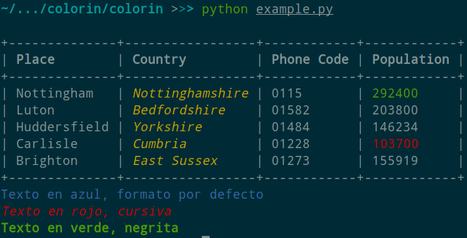

# Colorin

La siguiente clase permite el coloreado y el formateo de la salida estándar para la terminal en lenguaje *python*.   
A su vez, la clase es polimórfica y se puede instanciar indicando los títulos de la cabecera para generar la tabla que se formteará adaptándose al tamaño de los campos.



### Instalación

`$pip install colorin`

### Uso de la Clase

- [x] Importar e instanciar la clase **colorin** sin parámetros o con una lista de campos para cabecera de tabla.
- [x] Llamar a la función *print* de python y al método-color de la clase **colorin** y el formato elegido, no obligatorio, según la siguente tabla:

**Color**

| Color | Método
|---|---
| Negro | \_black
| Rojo | \_red |
| Verde | \_green |
| Amarillo | \_yellow |
| Azul | \_blue |
| Magenta | \_magenta |
|  (...) | (...) |

  **Formato**

  | Color | Método
  |---|---
  | bold | 'bo'
  | dim | 'di'
  | cursiva | 'it'
  | underline | 'un'
  | Azul | 'rv'
  | Magenta | 'hi'
  | blink | 'bl'
  | reverse | 'rv'
  | hidden | 'hi'
  | tachado | 'cr'

#### Ejemplo:

```python

# -*- coding: utf-8 -*-
#!/usr/bin/env python3

from colorin import Colorin

col= Colorin()
print (col._cyan("Texto en cyan", 'bo')
```

#### Mostrar texto en la misma línea

Agregar el parámetro `end='\r'` al *print*:

```python
for i in range(10):
  print(col._lblue("Recibido...%d"%i), end='\r')
```

## Creando tabla con Colorin

Para usar la clase para mostrar la tabla, instanciar la clase con los campos de la tabla. Agregar las filas con el método add_row y la lista de valores por columna. Se puede sustituir los *None* por '' o incluso la lista pude contener menos items que la cabecera, pero si hubiera más, se generaría un error.    
Por supuesto, se puede dar color y formato a los campos, salvo a los de cabecera que por defecto tiene efecto *bold*.

`class colorin([lista])`   
Devuelve lista de los títulos de cabecera de tabla.

> `.add_row([lista])`     
> Agrega fila con el contenido de los campos. No superar el número de campos de la cabecera.
> `._printTable()`   
> Imprime la tabla generada.
>
> `._header()`     
> Devuelve lista de campos de la cabaecera.
>
> `._rows()`     
> Devuelve lista de los campos de las filas.
>
> `._len_header()`     
> Devuelve lista de enteros con los tamaños de las columnas.

```python
# -*- coding: utf-8 -*-
#!/usr/bin/env python3

from colorin import Colorin

col= Colorin(['Place', 'Country', 'Population'])

col.add_row(['Nottingham', 'Nottinghamshire', 292400])
col.add_row(['Luton', 'Bedfordshire', 203800])
col.add_row(['Huddersfield', 'Yorkshire', 146234])

print(col._printTable())
```


Espero sea de utilidad :+1:
